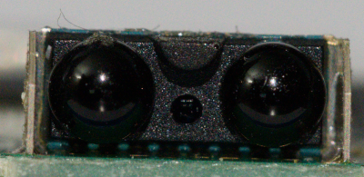
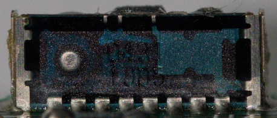
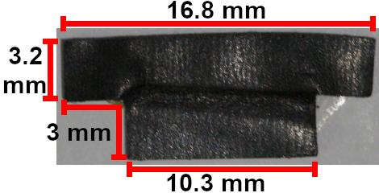

# Circuit board

*Original schematic by Tauwasser*

For KiCad files for a newer version see [here](https://github.com/Mattias-Software/pokemon_mini_schematic/tree/main/schematic/kicad_files)

For an interactive tracing tool see [here](https://pm.remysharp.com/)

The console has a main board and also a daughter board which contains the voltage step-up circuit. Largely, the daughter board is not labeled. It connects to the LCD via a <abbr title="Flexible Printed Circuit">FPC</abbr>, to the cartidge via the custom 33-pin connector, to the buzzer via two wires, and to the rumble motor via a pad which its terminals press against when the unit is closed.

The board has a marking located above the [POWER][] contact which reads `HGC0110-330010-xx` where xx can be 01 or 02 which indicates the board revision. There is a marking to the bottom right of [PAD1][] reading `Ax` where x is some number, 8 on my JP 01 board but 4 on my US 01 board.

Printed above [CN3][] (move the black part into the locked position to see) is: √̅ᴛ 7 ▲ [94V-0](https://en.wikipedia.org/wiki/UL_94) followed by a 4-digit number written in a 7-segment font. Nearby-ish (closer on 02 revision) is the <abbr title="Underwriters Laboratory">UL</abbr> Recognized mark.

[F1]: #f1
[L1]: #l1
[PAD1]: #pad1
[PAD2]: #pad2
[S1]: #s1
[U1]: #u1
[U2]: #u2
[U3]: #u3
[U4]: #u4
[U5]: #u5

## Using this document

We describe locations as either front (F) (screen-side) or back (B) (cart-side) and use the following abbreviations: top-left (TL), top-right (TR), middle-left (ML), middle-right (MR), bottom-left (BL), and bottom-right (BR).

When looking at the cart side, "left" is the negative end of the battery terminal and "top" is the side the cartridge enters. In this orientation the 1.5V on the battery image can be read correctly.

When looking at the screen side, "left" is where the LEFT contact is and "top" is where the IR blaster is. In this orientation all the button contact labels can be read correctly.

For terminals on a component, they're described based on the orientation of the text on the silk-screen. Known components' pins may be named.

Every label on the board is listed below but there may not be anything interesting to say about the component. To see all its connections, check the schematics instead.

## Differences between board 01 and 02

The board has a revision marker printed above the [POWER][] contact, at the end of the string.

The boards are largely the same but with some minor differences:

* [C21][] has been moved slightly to the left in 02
* [C9][] is unpopulated in 02 and has been placed to the left of [R8][], which has been rotated 90⁰ counter-clockwise
* [U5][] has been rotated 90⁰ clockwise and moved up slightly in 02
* [R41][] and [R42][] have been added under [U5][] in 02, and do not exist at all in 01
* [R34][], [R38][], and [R39][] have been repositioned to accommodate R41/R42
* [R12][] has been rotated 90⁰ clockwise in 02

## Legend

The A# (e.g. A4) printed under PAD1 is not a component label, but the purpose is unclear. The 0# (e.g. 02) printed next to the negative battery terminal is a copy of the final component of the identifier printed above the power contact (e.g. HC0110-330010-**02**). These examples are from the images above; in contrast my Japanese Wooper Blue unit has A8 and 01.

* C - Capacitor
* CN - Connector
* D - Diode
  * A - Anode (of diode 1)
  * C - cathode of diode 1 & anode of diode 2
  * K - Cathode (of diode 2)
* F - Fuse
* L - Coil
* PAD - Pad
* Q - Transistor
  * B - Base
  * C - Collector
  * E - Emitter
  * D - Drain
  * G - Ground
  * S - Source
* R - Resistor
* RV - Variable Resistor
* S - Shield
* SW - Switch
* TP - Test Point
* U - Unit: voltage regulator, EEPROM, IC, IrDA, voltage detector
* Y - Oscillator

## Capacitors

All capacitors on the main board, except for three of them, are surface mounted (SMD) multilayer ceramic capacitors (MLCC).

C1, C4, and C5 are all SMD cylindrical aluminum electrolytic capacitors with a capacitance of 100 <abbr title="microfarad">μF</abbr>. They're 6.3mm diameter and ~4.5 mm tall.

<table>
<thead>
<tr>
<th>Label</th>
<th>Populated?</th>
<th>Location</th>
<th>Capacitance</th>
<th>Description</th>
</tr>
</thead>
<tbody>
<tr>
<td><a id="user-content-c1">C1</a></td>
<td>yes</td>
<td>B MR</td>
<td>100 μF</td>
<td>electrolytic</td>
</tr>
<tr>
<td><a id="user-content-c2">C2</a></td>
<td>yes</td>
<td>B MR, left of <a href="#user-content-c1">C1</a>+</td>
<td>?</td>
<td>ceramic</td>
</tr>
<tr>
<td><a id="user-content-c3">C3</a></td>
<td>yes</td>
<td>F ML, right of <a href="#user-content-c4">C4</a></td>
<td>?</td>
<td>ceramic</td>
</tr>
<tr>
<td><a id="user-content-c4">C4</a></td>
<td>yes</td>
<td>F ML</td>
<td>100 μF</td>
<td>electrolytic</td>
</tr>
<tr>
<td><a id="user-content-c5">C5</a></td>
<td>yes</td>
<td>B ML</td>
<td>100 μF</td>
<td>electrolytic</td>
</tr>
<tr>
<td><a id="user-content-c6">C6</a></td>
<td>yes</td>
<td>F UL, below <a href="#q2">Q2</a></td>
<td>?</td>
<td>ceramic</td>
</tr>
<tr>
<td><a id="user-content-c7">C7</a></td>
<td>yes</td>
<td>B ML, TL of <a href="#u1">U1</a></td>
<td>?</td>
<td>ceramic</td>
</tr>
<tr>
<td><a id="user-content-c8">C8</a></td>
<td>yes</td>
<td>B BR, BR of <a href="#u1">U1</a></td>
<td>?</td>
<td>ceramic</td>
</tr>
<tr>
<td><a id="user-content-c9">C9</a></td>
<td>01-only</td>
<td>F UR, above <a href="#u5">U5</a></td>
<td>?</td>
<td>ceramic</td>
</tr>
<tr>
<td><a id="user-content-c10">C10</a></td>
<td>yes</td>
<td>F MR, above <a href="#user-content-r34">R34</a></td>
<td>?</td>
<td>ceramic</td>
</tr>
<tr>
<td><a id="user-content-c11">C11</a></td>
<td>yes</td>
<td>F ML, left of <a href="#tp3">TP3</a></td>
<td>?</td>
<td>ceramic</td>
</tr>
<tr>
<td><a id="user-content-c12">C12</a></td>
<td>yes</td>
<td>F ML, right of <a href="#user-content-r2">R2</a></td>
<td>?</td>
<td>ceramic</td>
</tr>
<tr>
<td><a id="user-content-c13">C13</a></td>
<td>no</td>
<td>F ML, left of <a href="#user-content-r9">R9</a></td>
<td>30 pF (rec)</td>
<td>named CG2 in S1C88 TMs</td>
</tr>
<tr>
<td><a id="user-content-c14">C14</a></td>
<td>no</td>
<td>F MR, right of <a href="#y2">Y2</a></td>
<td>30 pF (rec)</td>
<td>named CD2 in S1C88 TMs</td>
</tr>
<tr>
<td><a id="user-content-c15">C15</a></td>
<td>yes</td>
<td>F MR, right of <a href="#y1">Y1</a></td>
<td>?</td>
<td>ceramic, named CG1 in S1C88 TMs</td>
</tr>
<tr>
<td><a id="user-content-c16">C16</a></td>
<td>yes</td>
<td>B BL, between <a href="#user-content-r7">R7</a> &amp; <a href="#user-content-r11">R11</a></td>
<td>?</td>
<td>ceramic</td>
</tr>
<tr>
<td><a id="user-content-c17">C17</a></td>
<td>yes</td>
<td>F UR, right of <a href="#user-content-r18">R18</a></td>
<td>?</td>
<td>ceramic</td>
</tr>
<tr>
<td><a id="user-content-c18">C18</a></td>
<td>yes</td>
<td>F UR, right of <a href="#user-content-c17">C17</a></td>
<td>?</td>
<td>ceramic</td>
</tr>
<tr>
<td><a id="user-content-c19">C19</a></td>
<td>yes</td>
<td>B BR, above <a href="#u2">U2</a></td>
<td>?</td>
<td>ceramic</td>
</tr>
<tr>
<td><a id="user-content-c20">C20</a></td>
<td>yes</td>
<td>F UR, below <a href="#user-content-c21">C21</a></td>
<td>?</td>
<td>ceramic</td>
</tr>
<tr>
<td><a id="user-content-c21">C21</a></td>
<td>yes</td>
<td>F UR, BR of <a href="#user-content-c25">C25</a></td>
<td>?</td>
<td>ceramic</td>
</tr>
<tr>
<td><a id="user-content-c22">C22</a></td>
<td>yes</td>
<td>F UR, right of <a href="#user-content-c23">C23</a></td>
<td>?</td>
<td>ceramic</td>
</tr>
<tr>
<td><a id="user-content-c23">C23</a></td>
<td>yes</td>
<td>F UR, right of <a href="#user-content-c18">C18</a></td>
<td>?</td>
<td>ceramic</td>
</tr>
<tr>
<td><a id="user-content-c24">C24</a></td>
<td>yes</td>
<td>F ML, above <a href="#user-content-c4">C4</a></td>
<td>1 μF</td>
<td>ceramic</td>
</tr>
<tr>
<td><a id="user-content-c25">C25</a></td>
<td>yes</td>
<td>F UR, below <a href="#user-content-c23">C23</a></td>
<td>1 μF</td>
<td>ceramic</td>
</tr>
<tr>
<td><a id="user-content-c26">C26</a></td>
<td>yes</td>
<td>F MR, above <a href="#d3">D3</a></td>
<td>1 μF</td>
<td>ceramic</td>
</tr>
<tr>
<td><a id="user-content-c27">C27</a></td>
<td>yes</td>
<td>F MR, BR of <a href="#cn3">CN3</a></td>
<td>1 μF</td>
<td>ceramic</td>
</tr>
<tr>
<td><a id="user-content-c28">C28</a></td>
<td>yes</td>
<td>F UL, below <a href="#l1">L1</a></td>
<td>?</td>
<td>ceramic</td>
</tr>
<tr>
<td><a id="user-content-c29">C29</a></td>
<td>yes</td>
<td>B ML, right of <a href="#pad2">PAD2</a></td>
<td>?</td>
<td>ceramic</td>
</tr>
<tr>
<td><a id="user-content-c30">C30</a></td>
<td>yes</td>
<td>B ML, BL of <a href="#u1">U1</a></td>
<td>?</td>
<td>ceramic</td>
</tr>
<tr>
<td><a id="user-content-c31">C31</a></td>
<td>yes</td>
<td>B MR, right of <a href="#cn4">CN4</a></td>
<td>?</td>
<td>ceramic</td>
</tr>
<tr>
<td><a id="user-content-c32">C32</a></td>
<td>yes</td>
<td>B MR, under <a href="#user-content-c31">C31</a></td>
<td>?</td>
<td>ceramic</td>
</tr>
<tr>
<td><a id="user-content-c33">C33</a></td>
<td>yes</td>
<td>F ML, left of <a href="#user-content-c13">C13</a></td>
<td>?</td>
<td>ceramic</td>
</tr>
<tr>
<td><a id="user-content-c34">C34</a></td>
<td>no</td>
<td>F UR, below <a href="#u5">U5</a></td>
<td>?</td>
<td>-</td>
</tr>
</tbody>
</table>

[C1]: #user-content-c1
[C2]: #user-content-c2
[C3]: #user-content-c3
[C4]: #user-content-c4
[C5]: #user-content-c5
[C6]: #user-content-c6
[C7]: #user-content-c7
[C8]: #user-content-c8
[C9]: #user-content-c9
[C10]: #user-content-c10
[C11]: #user-content-c11
[C12]: #user-content-c12
[C13]: #user-content-c13
[C14]: #user-content-c14
[C15]: #user-content-c15
[C16]: #user-content-c16
[C17]: #user-content-c17
[C18]: #user-content-c18
[C19]: #user-content-c19
[C20]: #user-content-c20
[C21]: #user-content-c21
[C22]: #user-content-c22
[C23]: #user-content-c23
[C24]: #user-content-c24
[C25]: #user-content-c25
[C26]: #user-content-c26
[C27]: #user-content-c27
[C28]: #user-content-c28
[C29]: #user-content-c29
[C30]: #user-content-c30
[C31]: #user-content-c31
[C32]: #user-content-c32
[C33]: #user-content-c33
[C34]: #user-content-c34

## Connectors

[CN3]: #cn3
[CN4]: #cn4

### CN3

Connector slot for the FPC to the LCD, pins 1 (left) and 29 (right) are labeled.

* White portion:
  * Length: 18.7 (base & tips of catch), 18 mm (top of catch), 17.5 (body)
  * Depth: 3.6 mm
  * Height: ?
* Black portion:
  * Length: 20.1 mm (top), 19.1 mm (bottom), 14.8 mm (inside of bottom), 2.6 mm (edges)
  * Depth: 1.2 mm (top), ? (bottom), 4.8 mm (top + hooks)
  * Height: 1.9 mm (edges), 1 mm (middle)
* Pitch: 0.5 mm

#### Pins

Pin names are taken from the S1D15605 docs.

I/O listed from the perspective of the LCD. PS = Power Supply.

<table>
<thead>
<tr>
<th align="center">Pin #</th>
<th>Name</th>
<th align="center">I/O</th>
<th>Description</th>
</tr>
</thead>
<tbody>
<tr>
<td align="center"><a id="user-content-fpc-1">1</a></td>
<td>VR</td>
<td align="center">I</td>
<td>Output voltage regulator terminal</td>
</tr>
<tr>
<td align="center"><a id="user-content-fpc-2">2</a></td>
<td>V5</td>
<td align="center">PS</td>
<td>Liquid crystal drive power supply level 5</td>
</tr>
<tr>
<td align="center"><a id="user-content-fpc-3">3</a></td>
<td>V4</td>
<td align="center">PS</td>
<td>Liquid crystal drive power supply level 4</td>
</tr>
<tr>
<td align="center"><a id="user-content-fpc-4">4</a></td>
<td>V3</td>
<td align="center">PS</td>
<td>Liquid crystal drive power supply level 3</td>
</tr>
<tr>
<td align="center"><a id="user-content-fpc-5">5</a></td>
<td>V2</td>
<td align="center">PS</td>
<td>Liquid crystal drive power supply level 2</td>
</tr>
<tr>
<td align="center"><a id="user-content-fpc-6">6</a></td>
<td>V1</td>
<td align="center">PS</td>
<td>Liquid crystal drive power supply level 1</td>
</tr>
<tr>
<td align="center"><a id="user-content-fpc-7">7</a></td>
<td>CAP2-</td>
<td align="center">O</td>
<td>DC/DC voltage converter<a class="footnote-ref" href="#fn:1">1</a></td>
</tr>
<tr>
<td align="center"><a id="user-content-fpc-8">8</a></td>
<td>CAP2+</td>
<td align="center">O</td>
<td>DC/DC voltage converter<a class="footnote-ref" href="#fn:1">1</a></td>
</tr>
<tr>
<td align="center"><a id="user-content-fpc-9">9</a></td>
<td>CAP1-</td>
<td align="center">O</td>
<td>DC/DC voltage converter<a class="footnote-ref" href="#fn:1">1</a></td>
</tr>
<tr>
<td align="center"><a id="user-content-fpc-10">10</a></td>
<td>CAP1+</td>
<td align="center">O</td>
<td>DC/DC voltage converter<a class="footnote-ref" href="#fn:1">1</a></td>
</tr>
<tr>
<td align="center"><a id="user-content-fpc-11">11</a></td>
<td>CAP3-</td>
<td align="center">O</td>
<td>DC/DC voltage converter<a class="footnote-ref" href="#fn:1">1</a></td>
</tr>
<tr>
<td align="center"><a id="user-content-fpc-12">12</a></td>
<td>VOUT</td>
<td align="center">I/O</td>
<td>DC/DC voltage converter<a class="footnote-ref" href="#fn:1">1</a></td>
</tr>
<tr>
<td align="center"><a id="user-content-fpc-13">13</a></td>
<td>VSS</td>
<td align="center">PS</td>
<td>Ground (GND)</td>
</tr>
<tr>
<td align="center"><a id="user-content-fpc-14">14</a></td>
<td>VDD</td>
<td align="center">PS</td>
<td>Shared with MPU power supply terminal VCC</td>
</tr>
<tr>
<td align="center"><a id="user-content-fpc-15">15</a></td>
<td>D7</td>
<td align="center">I/O</td>
<td>Data bit 7</td>
</tr>
<tr>
<td align="center"><a id="user-content-fpc-16">16</a></td>
<td>D6</td>
<td align="center">I/O</td>
<td>Data bit 6</td>
</tr>
<tr>
<td align="center"><a id="user-content-fpc-17">17</a></td>
<td>D5</td>
<td align="center">I/O</td>
<td>Data bit 5</td>
</tr>
<tr>
<td align="center"><a id="user-content-fpc-18">18</a></td>
<td>D4</td>
<td align="center">I/O</td>
<td>Data bit 4</td>
</tr>
<tr>
<td align="center"><a id="user-content-fpc-19">19</a></td>
<td>D3</td>
<td align="center">I/O</td>
<td>Data bit 3</td>
</tr>
<tr>
<td align="center"><a id="user-content-fpc-20">20</a></td>
<td>D2</td>
<td align="center">I/O</td>
<td>Data bit 2</td>
</tr>
<tr>
<td align="center"><a id="user-content-fpc-21">21</a></td>
<td>D1</td>
<td align="center">I/O</td>
<td>Data bit 1</td>
</tr>
<tr>
<td align="center"><a id="user-content-fpc-22">22</a></td>
<td>D0</td>
<td align="center">I/O</td>
<td>Data bit 0</td>
</tr>
<tr>
<td align="center"><a id="user-content-fpc-23">23</a></td>
<td><u style="text-decoration:overline">RD</u></td>
<td align="center">I</td>
<td>0 = MPU is reading from D7~0</td>
</tr>
<tr>
<td align="center"><a id="user-content-fpc-24">24</a></td>
<td><u style="text-decoration:overline">WR</u></td>
<td align="center">I</td>
<td>0 = MPU is writing to D7~0</td>
</tr>
<tr>
<td align="center"><a id="user-content-fpc-25">25</a></td>
<td><u style="text-decoration:overline">A0</u></td>
<td align="center">I</td>
<td>0 = status/control, 1 = display data</td>
</tr>
<tr>
<td align="center"><a id="user-content-fpc-26">26</a></td>
<td><u style="text-decoration:overline">RES</u></td>
<td align="center">I</td>
<td>Reset. When LOW, the settings are initialized</td>
</tr>
<tr>
<td align="center"><a id="user-content-fpc-27">27</a></td>
<td><u style="text-decoration:overline">CS</u></td>
<td align="center">I</td>
<td>Chip Select. When LOW, the data/command I/O is enabled</td>
</tr>
<tr>
<td align="center"><a id="user-content-fpc-28">28</a></td>
<td>CL</td>
<td align="center">I<a class="footnote-ref" href="#fn:2">2</a></td>
<td>The display clock input terminal</td>
</tr>
<tr>
<td align="center"><a id="user-content-fpc-29">29</a></td>
<td>FR</td>
<td align="center">O<a class="footnote-ref" href="#fn:2">2</a></td>
<td>The liquid crystal alternating current signal</td>
</tr>
</tbody>
</table>

<ol>
<li id="fn:1">

CAP pins connect to the corresponding pin through a capacitor. See schematic for details.&#160;<a class="footnote-backref" href="#fnref:1" title="Jump back to footnote 1 in the text">&#8617;</a><a class="footnote-backref" href="#fnref2:1" title="Jump back to footnote 1 in the text">&#8617;</a><a class="footnote-backref" href="#fnref3:1" title="Jump back to footnote 1 in the text">&#8617;</a><a class="footnote-backref" href="#fnref4:1" title="Jump back to footnote 1 in the text">&#8617;</a><a class="footnote-backref" href="#fnref5:1" title="Jump back to footnote 1 in the text">&#8617;</a><a class="footnote-backref" href="#fnref6:1" title="Jump back to footnote 1 in the text">&#8617;</a>

</li>
<li id="fn:2">

Direction configured by the PM's hardware.&#160;<a class="footnote-backref" href="#fnref:2" title="Jump back to footnote 2 in the text">&#8617;</a><a class="footnote-backref" href="#fnref2:2" title="Jump back to footnote 2 in the text">&#8617;</a>

</li>
</ol>

[LVR]: #user-content-fpc-1
[LV5]: #user-content-fpc-2
[LV4]: #user-content-fpc-3
[LV3]: #user-content-fpc-4
[LV2]: #user-content-fpc-5
[LV1]: #user-content-fpc-6
[LC2-]: #user-content-fpc-7
[LC2+]: #user-content-fpc-8
[LC1-]: #user-content-fpc-9
[LC1+]: #user-content-fpc-10
[LC3-]: #user-content-fpc-11
[LVO]: #user-content-fpc-12
[LVS]: #user-content-fpc-13
[LVD]: #user-content-fpc-14
[LD7]: #user-content-fpc-15
[LD6]: #user-content-fpc-16
[LD5]: #user-content-fpc-17
[LD4]: #user-content-fpc-18
[LD3]: #user-content-fpc-19
[LD2]: #user-content-fpc-20
[LD1]: #user-content-fpc-21
[LD0]: #user-content-fpc-22
[LRD]: #user-content-fpc-23
[LWR]: #user-content-fpc-24
[LA0]: #user-content-fpc-25
[LRES]: #user-content-fpc-26
[LCS]: #user-content-fpc-27
[LCL]: #user-content-fpc-28
[LFR]: #user-content-fpc-29

### CN4

Cartridge slot connector, pins 33 (left) and 1 (right) are labeled.

* Length: 33.8 mm (base), 30.5
* Depth: 14.6 mm, 15.2 mm including pins (not the length at the base), 4.6 mm (basin of side slit to base)
* Height: ~5.9 mm (total), ? (top), 1.4 mm (base)
* Pitch: 0.7 mm

#### Pins

Pin names are largely from the community.

I/O listed from the perspective of the CPU. PS = Power Supply.

<table>
<thead>
<tr>
<th align="center">Pin #</th>
<th align="center">Card pin</th>
<th>Name</th>
<th align="center">I/O</th>
<th>Description</th>
</tr>
</thead>
<tbody>
<tr>
<td align="center"><a id="user-content-cart-1">1</a></td>
<td align="center"><a id="user-content-b1">B1</a></td>
<td>VDD</td>
<td align="center">PS</td>
<td>Stepped down from VCC</td>
</tr>
<tr>
<td align="center"><a id="user-content-cart-2">2</a></td>
<td align="center"><a id="user-content-a1">A1</a></td>
<td>VDD</td>
<td align="center">PS</td>
<td>Stepped down from VCC</td>
</tr>
<tr>
<td align="center"><a id="user-content-cart-3">3</a></td>
<td align="center"><a id="user-content-b2">B2</a></td>
<td>A20</td>
<td align="center">O</td>
<td>Address bit 20</td>
</tr>
<tr>
<td align="center"><a id="user-content-cart-4">4</a></td>
<td align="center"><a id="user-content-a2">A2</a></td>
<td>A9</td>
<td align="center">O</td>
<td>Address bit 9 when LALE=high, 19 when HALE=high</td>
</tr>
<tr>
<td align="center"><a id="user-content-cart-5">5</a></td>
<td align="center"><a id="user-content-b3">B3</a></td>
<td>A8</td>
<td align="center">O</td>
<td>Address bit 8 when LALE=high, 18 when HALE=high</td>
</tr>
<tr>
<td align="center"><a id="user-content-cart-6">6</a></td>
<td align="center"><a id="user-content-a3">A3</a></td>
<td>A7</td>
<td align="center">O</td>
<td>Address bit 7 when LALE=high, 17 when HALE=high</td>
</tr>
<tr>
<td align="center"><a id="user-content-cart-7">7</a></td>
<td align="center"><a id="user-content-b4">B4</a></td>
<td>A6</td>
<td align="center">O</td>
<td>Address bit 6 when LALE=high, 16 when HALE=high</td>
</tr>
<tr>
<td align="center"><a id="user-content-cart-8">8</a></td>
<td align="center"><a id="user-content-a4">A4</a></td>
<td>A5</td>
<td align="center">O</td>
<td>Address bit 5 when LALE=high, 15 when HALE=high</td>
</tr>
<tr>
<td align="center"><a id="user-content-cart-9">9</a></td>
<td align="center"><a id="user-content-b5">B5</a></td>
<td>A4</td>
<td align="center">O</td>
<td>Address bit 4 when LALE=high, 14 when HALE=high</td>
</tr>
<tr>
<td align="center"><a id="user-content-cart-10">10</a></td>
<td align="center"><a id="user-content-a5">A5</a></td>
<td>A3</td>
<td align="center">O</td>
<td>Address bit 3 when LALE=high, 13 when HALE=high</td>
</tr>
<tr>
<td align="center"><a id="user-content-cart-11">11</a></td>
<td align="center"><a id="user-content-b6">B6</a></td>
<td>A2</td>
<td align="center">O</td>
<td>Address bit 2 when LALE=high, 12 when HALE=high</td>
</tr>
<tr>
<td align="center"><a id="user-content-cart-12">12</a></td>
<td align="center"><a id="user-content-a6">A6</a></td>
<td>A1</td>
<td align="center">O</td>
<td>Address bit 1 when LALE=high, 11 when HALE=high</td>
</tr>
<tr>
<td align="center"><a id="user-content-cart-13">13</a></td>
<td align="center"><a id="user-content-b7">B7</a></td>
<td>A0</td>
<td align="center">O</td>
<td>Address bit 0 when LALE=high, 10 when HALE=high</td>
</tr>
<tr>
<td align="center"><a id="user-content-cart-14">14</a></td>
<td align="center"><a id="user-content-a7">A7</a></td>
<td>VDD</td>
<td align="center">PS</td>
<td>Stepped down from VCC</td>
</tr>
<tr>
<td align="center"><a id="user-content-cart-15">15</a></td>
<td align="center"><a id="user-content-b8">B8</a></td>
<td>HALE</td>
<td align="center">O</td>
<td>High address bits are latched when HALE is high</td>
</tr>
<tr>
<td align="center"><a id="user-content-cart-16">16</a></td>
<td align="center"><a id="user-content-a8">A8</a></td>
<td>VDD</td>
<td align="center">PS</td>
<td>No pad on cartridge</td>
</tr>
<tr>
<td align="center"><a id="user-content-cart-17">17</a></td>
<td align="center"><a id="user-content-b9">B9</a></td>
<td>LALE</td>
<td align="center">O</td>
<td>Low address bits are latched when LALE is high</td>
</tr>
<tr>
<td align="center"><a id="user-content-cart-18">18</a></td>
<td align="center"><a id="user-content-a9">A9</a></td>
<td>GND</td>
<td align="center">PS</td>
<td>Ground</td>
</tr>
<tr>
<td align="center"><a id="user-content-cart-19">19</a></td>
<td align="center"><a id="user-content-b10">B10</a></td>
<td>D0</td>
<td align="center">I/O</td>
<td>Data bit 0</td>
</tr>
<tr>
<td align="center"><a id="user-content-cart-20">20</a></td>
<td align="center"><a id="user-content-a10">A10</a></td>
<td>D1</td>
<td align="center">I/O</td>
<td>Data bit 1</td>
</tr>
<tr>
<td align="center"><a id="user-content-cart-21">21</a></td>
<td align="center"><a id="user-content-b11">B11</a></td>
<td>D2</td>
<td align="center">I/O</td>
<td>Data bit 2</td>
</tr>
<tr>
<td align="center"><a id="user-content-cart-22">22</a></td>
<td align="center"><a id="user-content-a11">A11</a></td>
<td>D3</td>
<td align="center">I/O</td>
<td>Data bit 3</td>
</tr>
<tr>
<td align="center"><a id="user-content-cart-23">23</a></td>
<td align="center"><a id="user-content-b12">B12</a></td>
<td>D4</td>
<td align="center">I/O</td>
<td>Data bit 4</td>
</tr>
<tr>
<td align="center"><a id="user-content-cart-24">24</a></td>
<td align="center"><a id="user-content-a12">A12</a></td>
<td>D5</td>
<td align="center">I/O</td>
<td>Data bit 5</td>
</tr>
<tr>
<td align="center"><a id="user-content-cart-25">25</a></td>
<td align="center"><a id="user-content-b13">B13</a></td>
<td>D6</td>
<td align="center">I/O</td>
<td>Data bit 6</td>
</tr>
<tr>
<td align="center"><a id="user-content-cart-26">26</a></td>
<td align="center"><a id="user-content-a13">A13</a></td>
<td>D7</td>
<td align="center">I/O</td>
<td>Data bit 7</td>
</tr>
<tr>
<td align="center"><a id="user-content-cart-27">27</a></td>
<td align="center"><a id="user-content-b14">B14</a></td>
<td>OE</td>
<td align="center">O</td>
<td>Output Enable. Reading data when OE is high</td>
</tr>
<tr>
<td align="center"><a id="user-content-cart-28">28</a></td>
<td align="center"><a id="user-content-a14">A14</a></td>
<td>IRQ</td>
<td align="center">I</td>
<td>Causes <a href="./cpu/interrupts.md#cartridge-irq">Cartridge IRQ</a> when IRQ is high</td>
</tr>
<tr>
<td align="center"><a id="user-content-cart-29">29</a></td>
<td align="center"><a id="user-content-b15">B15</a></td>
<td>WE</td>
<td align="center">O</td>
<td>Write Enable</td>
</tr>
<tr>
<td align="center"><a id="user-content-cart-30">30</a></td>
<td align="center"><a id="user-content-a15">A15</a></td>
<td>CS</td>
<td align="center">O</td>
<td>Chip Select</td>
</tr>
<tr>
<td align="center"><a id="user-content-cart-31">31</a></td>
<td align="center"><a id="user-content-b16">B16</a></td>
<td>CARD_N</td>
<td align="center">I</td>
<td>Card detect. Active-low. Connected to GND in the cartridge</td>
</tr>
<tr>
<td align="center"><a id="user-content-cart-32">32</a></td>
<td align="center"><a id="user-content-a16">A16</a></td>
<td>GND</td>
<td align="center">PS</td>
<td>Ground</td>
</tr>
<tr>
<td align="center"><a id="user-content-cart-33">33</a></td>
<td align="center"><a id="user-content-b17">B17</a></td>
<td>GND</td>
<td align="center">PS</td>
<td>Ground</td>
</tr>
</tbody>
</table>

[B1]: #user-content-b1
[A1]: #user-content-a1
[B2]: #user-content-b2
[A2]: #user-content-a2
[B3]: #user-content-b3
[A3]: #user-content-a3
[B4]: #user-content-b4
[A4]: #user-content-a4
[B5]: #user-content-b5
[A5]: #user-content-a5
[B6]: #user-content-b6
[A6]: #user-content-a6
[B7]: #user-content-b7
[A7]: #user-content-a7
[B8]: #user-content-b8
[A8]: #user-content-a8
[B9]: #user-content-b9
[A9]: #user-content-a9
[B10]: #user-content-b10
[A10]: #user-content-a10
[B11]: #user-content-b11
[A11]: #user-content-a11
[B12]: #user-content-b12
[A12]: #user-content-a12
[B13]: #user-content-b13
[A13]: #user-content-a13
[B14]: #user-content-b14
[A14]: #user-content-a14
[B15]: #user-content-b15
[A15]: #user-content-a15
[B16]: #user-content-b16
[A16]: #user-content-a16
[B17]: #user-content-b17

## Contacts

The keypad uses contacts under a likely silicone membrane with a carbon coating on the bottom bridging them to ground. The C button is [SW1][] rather than one of these.

[A]: #a
[B]: #a
[POWER]: #power
[RESET]: #reset
[UP]: #up
[LEFT]: #left
[RIGHT]: #right
[DOWN]: #down

### A

The TL and BR contact points are GND while the other connects to the [CPU][U3] and [TP1][].

### B

The TL and BR contact points are GND while the other connects to the [CPU][U3].

### POWER

The TL and BR contact points are GND while the other two connect to the [CPU][U3] and [TP2][].

### RESET

The TL and BR contact points are GND while the other two connect to the [CPU][U3].

### UP

The right contact point is GND while the other connects to the [CPU][U3].

### LEFT

The top contact point is GND while the other connects to the [CPU][U3].

### RIGHT

The bottom contact point is GND while the other connects to the [CPU][U3].

### DOWN

The left contact point is GND while the other connects to the [CPU][U3].

## Diodes

[D1]: #d1
[D2]: #d2
[D3]: #d3
[D4]: #d4
[D5]: #d5
[D6]: #d6

### D1

Located screen-side, below [C4][]. Anode top.

### D2

Located screen-side, right of [R5][]. Anode left.

### D3

A SOT23 diode, possibly [1SS226](https://toshiba.semicon-storage.com/us/semiconductor/product/diodes/detail.1SS226.html) (TODO: confirm). Same chip as [D4][]

Located screen-side, middle-right. 3-pin AKC (pins labeled).

### D4

Same chip as [D3][]

Located cart-side, above [C5][]. 3-pin AKC (pins labeled).

### D5

Located screen-side, bottom-right. Anode top.

### D6

Located screen-side, bottom-right. Anode top.

## F1

Fuse 1. Located cart-side, bottom-right of C2.

## L1

why

## PAD1

The left contact (labeled 2) is GND. This pad connects the rumble motor mounted in the back of the case to the system.

* Each contact is 2 mm x 3.2 mm with a total width of ~4.5 mm

### Motor

A 2-pin spring contact ERM vibration motor contained in a light gray silicone sleeve which can be slipped off with some trouble, inserted into the case back without glue.

* Height: 15.7 (total), 12.3 (cylinder with exit bump), 11.4 (cylinder)
* Diameter of cylinder: 4 mm
* Diameter of shaft: 0.7 mm
* Weight: 5.4 mm long, 3.4 mm at deepest, 2.8 mm tall
* Length of base: 5 mm
* Length of pins: ~5 mm
* Pitch (of motor): 1.5 mm
* Silicone sleeve: 11.6 mm tall, 4.9 mm wide, 5.5 mm depth, 0.5 mm at thinnest to 1.8 mm at thickest

## PAD2

Pin 1 connects [BZ][] through a red wire to the inner circle (top electrode) of the speaker. Pin 2 connects [BZ-][] through a black wire to the outer circle (metal plate).

### Speaker

~20 mm diameter piezo buzzer with ~15 mm inner diameter (incl. ring). It's glued to the back casing. Thickness unknown.

## Transistors

[Q1]: #q1
[Q2]: #q2
[Q3]: #q3

### Q1

A SOT89-3 transistor, possibly 2SJ361 (TODO: confirm).

This detects the <u style="text-decoration:overline">CART_POW_EN</u> signal and steps down the VCC to input into the cartridge bus.

### Q2

A SOT89-3 transistor, possibly 2SA1419 (TODO: confirm).

This powers the rumble motor when [Q3][] closes.

### Q3

A SOT323 transistor, possibly 2SC4155 (TODO: confirm).

This detects the RUMBLE signal, connecting [Q2][] to GND.

## Resistors

R41 and R42 pads do not exist on the 01 board.

R9 is named `Rf` in the S1C88 technical manuals.

| Label        | Populated? | Location                         | Resistance |
| ------------ | ---------- | -------------------------------- | ---------- |
| <a id="user-content-r1">R1</a>  | yes        | F TL, between [Q3][] & [Q1][]    | 1 kΩ       |
| <a id="user-content-r2">R2</a>  | no         | F ML, above [RV1][]              | ?          |
| <a id="user-content-r3">R3</a>  | yes        | F TL, BL of [Q1][]               | 100 Ω      |
| <a id="user-content-r4">R4</a>  | yes        | F TL, BL of [Q3][]               | 10 kΩ      |
| <a id="user-content-r5">R5</a>  | yes        | F TL, right of [R4][]            | 100 kΩ     |
| <a id="user-content-r6">R6</a>  | yes        | B BR, right of [R10][]           | 200 Ω      |
| <a id="user-content-r7">R7</a>  | yes        | B BL, left of [C16][]            | 33 Ω       |
| <a id="user-content-r8">R8</a>  | yes        | F TR, below [C20][]              | 68 kΩ      |
| <a id="user-content-r9">R9</a>  | yes        | F ML, left of [Y2][]             | 1 MΩ       |
| <a id="user-content-r10">R10</a> | yes        | B BR, below [U1][]               | 10 kΩ      |
| <a id="user-content-r11">R11</a> | no         | B BL, below [U1][]               | ?          |
| <a id="user-content-r12">R12</a> | yes        | B TL                             | 1 kΩ       |
| <a id="user-content-r13">R13</a> | yes        | B ML, BL of [D4][]               | 100 Ω      |
| <a id="user-content-r14">R14</a> | yes        | F MR, below [D3][]               | 100 Ω      |
| <a id="user-content-r15">R15</a> | yes        | F MR, below [R34][]              | 500 kΩ     |
| <a id="user-content-r16">R16</a> | yes        | B BR, TL of [U2][]               | 1 kΩ       |
| <a id="user-content-r17">R17</a> | yes        | B BR, below [U2][]               | 10 kΩ      |
| <a id="user-content-r18">R18</a> | yes        | F TR, BR of [U4][]               | 33 Ω       |
| <a id="user-content-r19">R19</a> | yes        | F TL, below [R20][]              | 100 kΩ     |
| <a id="user-content-r20">R20</a> | yes        | F TL, below [U4][]               | 11 Ω       |
| <a id="user-content-r21">R21</a> | yes        | F TL, below [R25][]              | 270 kΩ     |
| <a id="user-content-r22">R22</a> | yes        | F TL, below [R21][]              | 1.3 MΩ     |
| <a id="user-content-r23">R23</a> | yes        | F ML, BR of [Q1][]               | 33 Ω       |
| <a id="user-content-r24">R24</a> | yes        | F ML, below [R23][]              | 33 Ω       |
| <a id="user-content-r25">R25</a> | yes        | F TL, below [R26][]              | 33 Ω       |
| <a id="user-content-r26">R26</a> | yes        | F TL, below [R27][]              | 33 Ω       |
| <a id="user-content-r27">R27</a> | yes        | F TL, below [R28][]              | 33 Ω       |
| <a id="user-content-r28">R28</a> | yes        | F TL, below [R4][]               | 33 Ω       |
| <a id="user-content-r29">R29</a> | yes        | F TL, below [D2][]               | 33 Ω       |
| <a id="user-content-r30">R30</a> | yes        | F TL, below [R29][]              | 33 Ω       |
| <a id="user-content-r31">R31</a> | yes        | F MR, left of [R32][]            | 33 Ω       |
| <a id="user-content-r32">R32</a> | yes        | F MR, BL of [C27][]              | 33 Ω       |
| <a id="user-content-r33">R33</a> | yes        | F ML, right of [TP3][]           | 33 Ω       |
| <a id="user-content-r34">R34</a> | yes        | F MR, BR (01)/below (02) [C10][] | 33 Ω       |
| <a id="user-content-r35">R35</a> | yes        | F ML, right of [R33][]           | 33 Ω       |
| <a id="user-content-r36">R36</a> | yes        | F ML, right of [R35][]           | 33 Ω       |
| <a id="user-content-r37">R37</a> | yes        | F ML, right of [R40][]           | 33 Ω       |
| <a id="user-content-r38">R38</a> | yes        | F MR, right of [R39][]           | 100 kΩ     |
| <a id="user-content-r39">R39</a> | no         | F MR, right of [C10][]           | ?          |
| <a id="user-content-r40">R40</a> | yes        | F ML, right of [R36][]           | 500 kΩ     |
| <a id="user-content-r41">R41</a> | 02-only    | F MR, right of [R42][]           | ?          |
| <a id="user-content-r42">R42</a> | 02-only    | F MR, right of [C27][]           | 0 Ω        |

[R1]: #user-content-r1
[R2]: #user-content-r2
[R3]: #user-content-r3
[R4]: #user-content-r4
[R5]: #user-content-r5
[R6]: #user-content-r6
[R7]: #user-content-r7
[R8]: #user-content-r8
[R9]: #user-content-r9
[R10]: #user-content-r10
[R11]: #user-content-r11
[R12]: #user-content-r12
[R13]: #user-content-r13
[R14]: #user-content-r14
[R15]: #user-content-r15
[R16]: #user-content-r16
[R17]: #user-content-r17
[R18]: #user-content-r18
[R19]: #user-content-r19
[R20]: #user-content-r20
[R21]: #user-content-r21
[R22]: #user-content-r22
[R23]: #user-content-r23
[R24]: #user-content-r24
[R25]: #user-content-r25
[R26]: #user-content-r26
[R27]: #user-content-r27
[R28]: #user-content-r28
[R29]: #user-content-r29
[R30]: #user-content-r30
[R31]: #user-content-r31
[R32]: #user-content-r32
[R33]: #user-content-r33
[R34]: #user-content-r34
[R35]: #user-content-r35
[R36]: #user-content-r36
[R37]: #user-content-r37
[R38]: #user-content-r38
[R39]: #user-content-r39
[R40]: #user-content-r40
[R41]: #user-content-r41
[R42]: #user-content-r42
[RV1]: #rv1

### RV1

Located screen-side, middle left, right of [C3][].

## S1

The cartridge slot shield. Located cart-side, top. Has a long indented line with round caps in the center (but slightly below middle) of the bottom rectangle. The top has unevenly rounded edges and has two semi-circles indented along the top edge, placed 9.5 mm from either side.

* Length: 34.5 mm (base), ~33.2 mm (top), ~27.3 mm (indent)
* Depth: ~8.2 mm (base), ~6.7 mm (bottom)
* Height: ~1.6 mm (bottom), < 0.9 mm (top, this is where it rises to off the board)

## Switches

[SW1]: #sw1
[SW2]: #sw2

### SW1

A 2-pin right-angle push button switch with grounded shield. Located cart-side, top left.

The top pin is GND and the bottom connects to the [CPU][U3].

* Without shield: 6 mm square, 3 mm "height" at shortest point, feet add ~0.6 mm
* Shield: ~0.3 mm thick, 8.1 mm long, 3.6 mm "height" (side), 3.5 mm height not including through-hole pins
* Button: 1.3 mm "height", 3 mm diameter

### SW2

A 2-pin enclosed reed switch (TODO: confirm type). Located cart-side, bottom left.

The pins are labeled, pin 1 is signal and pin 2 is GND.

* Has a strange shape that's hard to measure...
* Height: 8 mm (total), 6.1 mm (up to base of top groove)
* Contained in 8.9 mm square
* Width between vertical grooves along sides: 8.3 mm
* Diameter of groove on top: ~7.6 mm
* Diameter of widest point on top: ~10.1 mm
* Pitch: ~7 mm (active pins), ~6 mm (shield pins)

## Test points

[TP1]: #tp1
[TP2]: #tp2
[TP3]: #tp3
[TP4]: #tp4
[TP5]: #tp5

### TP1

Tests the [A][] contact. Located cart-side, bottom left.

### TP2

Tests the [POWER][] contact. Located cart-side, bottom left. Next to it reads `(PON#)` possibly meaning "power on"

### TP3

Tests if cartridge can be detected. Located screen-side, middle left. A label reading `(CARD_N)` has an arrow pointing to it; this is the name of the line it's testing.

### TP4

Tests the IrDA's TXD line. Located screen-side, top center.

### TP5

Tests the IrDA's RXD line. Located screen-side, top center.

## U1

The voltage step-up converter daughter board. Located cart-side, center.

The board itself is 23 x 10 mm, likely ~1 mm thick.

Basically no component is labeled and no schematic has been made so all I can document is the package types.

* Four SOT416 chips
* One SOT23-5 chip
* Two SOT23 chips
* One SOT363 chip
* ALPS: a 6 mm x 6 mm 2-pin chip that looks circular from the top

### Pins

The pins are not labeled, so instead we use the numbers and names from Tauwasser's schematic.

I/O listed from the perspective of U1. PS = Power Supply.

| Pin # | Name | I/O | Location      | Description                      |
|:-----:| ---- |:---:| ------------- | -------------------------------- |
|   1   | VIN  | PSI | bottom right  | Battery power in                 |
|   2   | VOUT | PSO | top right     | VCC out               |
|   3   | ?    |  I  | top left      | Connects to POW_? pin of [U3][]  |
|   4   | GND  | PS  | bottom left   | Ground                           |
|   5   | ?    |  I  | bottom center | Connects to [POWER][] contact    |

## U2

A 24xx64-alike TSSOP-8 package EEPROM. Located cart-side, bottom right.

Pins 1-4 (left) and 7 (right) are wired to GND.

I/O listed from the perspective of the EEPROM. PS = Power Supply.

| Pin # | Name | I/O | Description        |
|:-----:| ---- |:---:| ------------------ |
|   1   | A0   |  I  | Address bit 0      |
|   2   | A1   |  I  | Address bit 1      |
|   3   | A2   |  I  | Address bit 2      |
|   4   | GND  | PS  | Ground             |
|   5   | SDA  | I/O | Serial data I/O    |
|   6   | SCL  |  I  | Serial clock input |
|   7   | WP   |  I  | Write protect      |
|   8   | VCC  | PS  | Power supply       |

Other I2C devices, such as a [DS1621 digital thermometer](https://web.archive.org/web/20080412185344/http://lupin.shizzle.it/?p=55), can be wired to the SDA/SCL lines of the EEPROM chip to add them to the bus.

## U3

The [S1C88V20](cpu) with glob top. Locate screen-side, middle center.

The name for this chip comes from Epson's S1C88 tooling, which contains a memory layout of this name as well as debugger modules of this name.

* Part number: S1C88V20B??????
  * S1 - Seiko Epson, previously E0
  * C - Model name: microcomputer
  * 88V20 - Model number
  * B - Shape: Assembled on board
  * ???? - Specifications (unknown)
  * ?? - Packing specification (unknown)
* Core CPU: S1C88 (MODEL3) CMOS 8-bit core CPU
* OSC1 Oscillation circuit: Crystal oscillation circuit (mask option) 32.768 kHz
* OSC3 Oscillation circuit: Crystal/Ceramic oscillation circuit (mask option) 4.0 MHz (allowable range unknown)
  * The internals of the chip when using this mask option should also allow applying an external clock signal to (probably) the left [Y2][] pin, after removing [R9][]
* Internal ROM capacity: 4 KiB
* Internal RAM capacity: 4 KiB
* Bus line:
  * Address bus: 11 bits + 2 latching bits
  * Data bus: 8 bits
  * CE/<u style="text-decoration:overline">CE</u> signal: 2 bits
  * WR/<u style="text-decoration:overline">WR</u> signal: 2 bit
  * RD/<u style="text-decoration:overline">RD</u> signal: 2 bit
* Input port: 10 bits
  * User input: 8 bits
  * Cartridge input: 2 bits
  * Configurable de-jitter
* Output port: 22
  * Address bus: 13 bits
  * Cartridge specific: 3 bits
  * LCD specific: 4 bits
  * Buzzer: 2 bits
* I/O port: 8~18 bits
  * General purpose: 8 bits
  * Data (unconfigurable): 8 bits
  * LCD (fixed by circuitry): 2 bits (unconfirmed)
* 16-bit programmable timer: 3 channels
  * Usable as 16 bits x 3 channels or 8 bits x 6 channels
  * Each is individually selectible as 16 bits
* Clock timer: 1 channel
  * Generating 1 sec signal with 32 kHz oscillation
* Seconds timer:
  * Manages real time clock
* LCD controller:
  * B&W dot-matrix display driven by an external driver ([S1D15605](lcd))
  * Scroll function available
  * 16x16 sprites available: 24
* Watchdog timer: probably exists but is not configurable and we cannot confirm whether or not it's used
* Supply voltage detection (SVD): ? value programmable
* Priority encoded interrupt engine
  * Hardware interrupts (total: 32)
    * External Interrupt:
      * Input interrupt: 10
    * Internal Interrupt:
      * 16-bit programmable timer interrupt: 6
      * Clock timer interrupt: 4
      * I/O port interrupt: 2
      * LCD controller interrupt: 2
    * NMI: 3
    * Unknown: 5
  * Software interrupts: up to 96 (45 implemented in Pokémon mini BIOS)
* Supply voltage: 3.0V (range per operating frequency unknown)
* Current consumption: ?
* Supply form: 64-pin CoB glob top

### Pins

The pins are not labeled, so instead we use the numbers and names (largely) from Tauwasser's schematic. A few names come from other official specifications, CARD_N and most of the keypad are labeled on the board elsewhere.

I/O listed from the perspective of the CPU. PS = Power Supply.

<table>
<thead>
<tr>
<th align="center">Pin #</th>
<th>Name</th>
<th align="center">I/O</th>
<th>Description</th>
</tr>
</thead>
<tbody>
<tr>
<td align="center"><a id="user-content-cpu-1">1</a></td>
<td>VCC</td>
<td align="center">PS</td>
<td>VCC (3v)</td>
</tr>
<tr>
<td align="center"><a id="user-content-cpu-2">2</a></td>
<td>OSC3</td>
<td align="center">I</td>
<td>Connects to <a href="#y2">Y2</a></td>
</tr>
<tr>
<td align="center"><a id="user-content-cpu-3">3</a></td>
<td>OSC4</td>
<td align="center">O</td>
<td>Connects to <a href="#y2">Y2</a></td>
</tr>
<tr>
<td align="center"><a id="user-content-cpu-4">4</a></td>
<td>CAP</td>
<td align="center">?</td>
<td>Connects to <a href="#user-content-c33">C33</a></td>
</tr>
<tr>
<td align="center"><a id="user-content-cpu-5">5</a></td>
<td>GND</td>
<td align="center">PS</td>
<td>Ground</td>
</tr>
<tr>
<td align="center"><a id="user-content-cpu-6">6</a></td>
<td>OSC1</td>
<td align="center">I</td>
<td>Connects to <a href="#y1">Y1</a></td>
</tr>
<tr>
<td align="center"><a id="user-content-cpu-7">7</a></td>
<td>OSC2</td>
<td align="center">O</td>
<td>Connects to <a href="#y1">Y1</a></td>
</tr>
<tr>
<td align="center"><a id="user-content-cpu-8">8</a></td>
<td>CAP</td>
<td align="center">?</td>
<td>Connects to <a href="#user-content-c16">C16</a></td>
</tr>
<tr>
<td align="center"><a id="user-content-cpu-9">9</a></td>
<td>POW_?</td>
<td align="center">O</td>
<td>Connects to <a href="#u1">U1</a></td>
</tr>
<tr>
<td align="center"><a id="user-content-cpu-10">10</a></td>
<td>VCC</td>
<td align="center">?</td>
<td>VCC (3v)</td>
</tr>
<tr>
<td align="center"><a id="user-content-cpu-11">11</a></td>
<td><u style="text-decoration:overline">RESET</u></td>
<td align="center">I</td>
<td><a href="#reset">RESET</a> contact input</td>
</tr>
<tr>
<td align="center"><a id="user-content-cpu-12">12</a></td>
<td>OPT</td>
<td align="center">?</td>
<td>?</td>
</tr>
<tr>
<td align="center"><a id="user-content-cpu-13">13</a></td>
<td><u style="text-decoration:overline">POWER</u></td>
<td align="center">I</td>
<td><a href="#power">POWER</a> contact input</td>
</tr>
<tr>
<td align="center"><a id="user-content-cpu-14">14</a></td>
<td><u style="text-decoration:overline">RIGHT</u></td>
<td align="center">I</td>
<td><a href="#right">RIGHT</a> contact input</td>
</tr>
<tr>
<td align="center"><a id="user-content-cpu-15">15</a></td>
<td><u style="text-decoration:overline">LEFT</u></td>
<td align="center">I</td>
<td><a href="#left">LEFT</a> contact input</td>
</tr>
<tr>
<td align="center"><a id="user-content-cpu-16">16</a></td>
<td><u style="text-decoration:overline">DOWN</u></td>
<td align="center">I</td>
<td><a href="#down">DOWN</a> contact input</td>
</tr>
<tr>
<td align="center"><a id="user-content-cpu-17">17</a></td>
<td><u style="text-decoration:overline">UP</u></td>
<td align="center">I</td>
<td><a href="#up">UP</a> contact input</td>
</tr>
<tr>
<td align="center"><a id="user-content-cpu-18">18</a></td>
<td><u style="text-decoration:overline">C</u></td>
<td align="center">I</td>
<td><a href="#sw1">SW1</a> input</td>
</tr>
<tr>
<td align="center"><a id="user-content-cpu-19">19</a></td>
<td><u style="text-decoration:overline">B</u></td>
<td align="center">I</td>
<td><a href="#a">B</a> contact input</td>
</tr>
<tr>
<td align="center"><a id="user-content-cpu-20">20</a></td>
<td><u style="text-decoration:overline">A</u></td>
<td align="center">I</td>
<td><a href="#a">A</a> contact input</td>
</tr>
<tr>
<td align="center"><a id="user-content-cpu-21">21</a></td>
<td><u style="text-decoration:overline">CARD_POW_EN</u></td>
<td align="center">O</td>
<td>Enable power to the cartridge</td>
</tr>
<tr>
<td align="center"><a id="user-content-cpu-22">22</a></td>
<td>BZ-</td>
<td align="center">O</td>
<td>Inverted <a href="#speaker">buzzer</a> signal</td>
</tr>
<tr>
<td align="center"><a id="user-content-cpu-23">23</a></td>
<td>BZ</td>
<td align="center">O</td>
<td><a href="#speaker">Buzzer</a> signal</td>
</tr>
<tr>
<td align="center"><a id="user-content-cpu-24">24</a></td>
<td>GPIO6</td>
<td align="center">I/O</td>
<td><a href="#sw2"><u style="text-decoration:overline">SHOCK</u></a></td>
</tr>
<tr>
<td align="center"><a id="user-content-cpu-25">25</a></td>
<td>GPIO5</td>
<td align="center">I/O</td>
<td>Powers down <a href="#u4">U4</a> when high</td>
</tr>
<tr>
<td align="center"><a id="user-content-cpu-26">26</a></td>
<td>GPIO4</td>
<td align="center">I/O</td>
<td>Enables <a href="#motor">rumble motor</a></td>
</tr>
<tr>
<td align="center"><a id="user-content-cpu-27">27</a></td>
<td>GPIO3</td>
<td align="center">I/O</td>
<td>Connects to <a href="#u2">U2</a>'s SCL</td>
</tr>
<tr>
<td align="center"><a id="user-content-cpu-28">28</a></td>
<td>GPIO2</td>
<td align="center">I/O</td>
<td>Connects to <a href="#u2">U2</a>'s SDA</td>
</tr>
<tr>
<td align="center"><a id="user-content-cpu-29">29</a></td>
<td>GPIO1</td>
<td align="center">I/O</td>
<td>Connects to <a href="#u4">U4</a>'s TXD</td>
</tr>
<tr>
<td align="center"><a id="user-content-cpu-30">30</a></td>
<td>GPIO0</td>
<td align="center">I/O</td>
<td>Connects to <a href="#u4">U4</a>'s RXD</td>
</tr>
<tr>
<td align="center"><a id="user-content-cpu-31">31</a></td>
<td>LCD_FR</td>
<td align="center">I/?</td>
<td>Connects to <a href="#user-content-fpc-29">CN3</a>'s FR</td>
</tr>
<tr>
<td align="center"><a id="user-content-cpu-32">32</a></td>
<td>LCD_CL</td>
<td align="center">?/O</td>
<td>Connects to <a href="#user-content-fpc-28">CN3</a>'s CL</td>
</tr>
<tr>
<td align="center"><a id="user-content-cpu-33">33</a></td>
<td>VCC</td>
<td align="center">?</td>
<td>VCC (3v)</td>
</tr>
<tr>
<td align="center"><a id="user-content-cpu-34">34</a></td>
<td>GND</td>
<td align="center">?</td>
<td>Ground</td>
</tr>
<tr>
<td align="center"><a id="user-content-cpu-35">35</a></td>
<td><u style="text-decoration:overline">LCD_CS</u></td>
<td align="center">O</td>
<td>Select LCD for bus communication</td>
</tr>
<tr>
<td align="center"><a id="user-content-cpu-36">36</a></td>
<td><u style="text-decoration:overline">LCD_WR</u></td>
<td align="center">O</td>
<td>Connects to <a href="#user-content-fpc-24">CN3</a>'s <u style="text-decoration:overline">WR</u></td>
</tr>
<tr>
<td align="center"><a id="user-content-cpu-37">37</a></td>
<td><u style="text-decoration:overline">LCD_RD</u></td>
<td align="center">O</td>
<td>Connects to <a href="#user-content-fpc-23">CN3</a>'s <u style="text-decoration:overline">RD</u></td>
</tr>
<tr>
<td align="center"><a id="user-content-cpu-38">38</a></td>
<td>LCD_A0</td>
<td align="center">O</td>
<td>Connects to <a href="#user-content-fpc-25">CN3</a>'s <u style="text-decoration:overline">A0</u></td>
</tr>
<tr>
<td align="center"><a id="user-content-cpu-39">39</a></td>
<td>D7</td>
<td align="center">I/O</td>
<td>Data bit 7 for <a href="#user-content-fpc-15">CN3</a> &amp; <a href="#user-content-a13">CN4</a></td>
</tr>
<tr>
<td align="center"><a id="user-content-cpu-40">40</a></td>
<td>D6</td>
<td align="center">I/O</td>
<td>Data bit 6 for <a href="#user-content-fpc-16">CN3</a> &amp; <a href="#user-content-b13">CN4</a></td>
</tr>
<tr>
<td align="center"><a id="user-content-cpu-41">41</a></td>
<td>D5</td>
<td align="center">I/O</td>
<td>Data bit 5 for <a href="#user-content-fpc-17">CN3</a> &amp; <a href="#user-content-a12">CN4</a></td>
</tr>
<tr>
<td align="center"><a id="user-content-cpu-42">42</a></td>
<td>D4</td>
<td align="center">I/O</td>
<td>Data bit 4 for <a href="#user-content-fpc-18">CN3</a> &amp; <a href="#user-content-b12">CN4</a></td>
</tr>
<tr>
<td align="center"><a id="user-content-cpu-43">43</a></td>
<td>D3</td>
<td align="center">I/O</td>
<td>Data bit 3 for <a href="#user-content-fpc-19">CN3</a> &amp; <a href="#user-content-a11">CN4</a></td>
</tr>
<tr>
<td align="center"><a id="user-content-cpu-44">44</a></td>
<td>D2</td>
<td align="center">I/O</td>
<td>Data bit 2 for <a href="#user-content-fpc-20">CN3</a> &amp; <a href="#user-content-b11">CN4</a></td>
</tr>
<tr>
<td align="center"><a id="user-content-cpu-45">45</a></td>
<td>D1</td>
<td align="center">I/O</td>
<td>Data bit 1 for <a href="#user-content-fpc-21">CN3</a> &amp; <a href="#user-content-a10">CN4</a></td>
</tr>
<tr>
<td align="center"><a id="user-content-cpu-46">46</a></td>
<td>D0</td>
<td align="center">I/O</td>
<td>Data bit 0 for <a href="#user-content-fpc-22">CN3</a> &amp; <a href="#user-content-b10">CN4</a></td>
</tr>
<tr>
<td align="center"><a id="user-content-cpu-47">47</a></td>
<td>HALE</td>
<td align="center">O</td>
<td>High address latch enable (<a href="#user-content-b8">CN4</a>)</td>
</tr>
<tr>
<td align="center"><a id="user-content-cpu-48">48</a></td>
<td>LALE</td>
<td align="center">O</td>
<td>Low address latch enable (<a href="#user-content-b9">CN4</a>)</td>
</tr>
<tr>
<td align="center"><a id="user-content-cpu-49">49</a></td>
<td>A0</td>
<td align="center">O</td>
<td>Address bit 0/10 (<a href="#user-content-b7">CN4</a>)</td>
</tr>
<tr>
<td align="center"><a id="user-content-cpu-50">50</a></td>
<td>A1</td>
<td align="center">O</td>
<td>Address bit 1/11 (<a href="#user-content-a6">CN4</a>)</td>
</tr>
<tr>
<td align="center"><a id="user-content-cpu-51">51</a></td>
<td>A2</td>
<td align="center">O</td>
<td>Address bit 2/12 (<a href="#user-content-b6">CN4</a>)</td>
</tr>
<tr>
<td align="center"><a id="user-content-cpu-52">52</a></td>
<td>A3</td>
<td align="center">O</td>
<td>Address bit 3/13 (<a href="#user-content-a5">CN4</a>)</td>
</tr>
<tr>
<td align="center"><a id="user-content-cpu-53">53</a></td>
<td>A4</td>
<td align="center">O</td>
<td>Address bit 4/14 (<a href="#user-content-b5">CN4</a>)</td>
</tr>
<tr>
<td align="center"><a id="user-content-cpu-54">54</a></td>
<td>A5</td>
<td align="center">O</td>
<td>Address bit 5/15 (<a href="#user-content-a4">CN4</a>)</td>
</tr>
<tr>
<td align="center"><a id="user-content-cpu-55">55</a></td>
<td>A6</td>
<td align="center">O</td>
<td>Address bit 6/16 (<a href="#user-content-b4">CN4</a>)</td>
</tr>
<tr>
<td align="center"><a id="user-content-cpu-56">56</a></td>
<td>A7</td>
<td align="center">O</td>
<td>Address bit 7/17 (<a href="#user-content-a3">CN4</a>)</td>
</tr>
<tr>
<td align="center"><a id="user-content-cpu-57">57</a></td>
<td>A8</td>
<td align="center">O</td>
<td>Address bit 8/18 (<a href="#user-content-b3">CN4</a>)</td>
</tr>
<tr>
<td align="center"><a id="user-content-cpu-58">58</a></td>
<td>A9</td>
<td align="center">O</td>
<td>Address bit 9/19 (<a href="#user-content-a2">CN4</a>)</td>
</tr>
<tr>
<td align="center"><a id="user-content-cpu-59">59</a></td>
<td>A20</td>
<td align="center">O</td>
<td>Address bit 20 (<a href="#user-content-b2">CN4</a>)</td>
</tr>
<tr>
<td align="center"><a id="user-content-cpu-60">60</a></td>
<td>OE</td>
<td align="center">O</td>
<td><a href="#user-content-b14">CN4</a>'s data Output Enable</td>
</tr>
<tr>
<td align="center"><a id="user-content-cpu-61">61</a></td>
<td>WE</td>
<td align="center">O</td>
<td><a href="#user-content-b15">CN4</a>'s Write Enable</td>
</tr>
<tr>
<td align="center"><a id="user-content-cpu-62">62</a></td>
<td>CS</td>
<td align="center">O</td>
<td>Select cartridge for bus communication</td>
</tr>
<tr>
<td align="center"><a id="user-content-cpu-63">63</a></td>
<td><u style="text-decoration:overline">CARD</u></td>
<td align="center">I</td>
<td><a href="#user-content-b16">Cartridge detect</a> input</td>
</tr>
<tr>
<td align="center"><a id="user-content-cpu-64">64</a></td>
<td>CN4-28</td>
<td align="center">I</td>
<td><a href="#user-content-a14">Cartridge IRQ</a> input</td>
</tr>
</tbody>
</table>

[BZ-]: #user-content-cpu-22
[BZ]: #user-content-cpu-23
[OSC1]: #user-content-cpu-6
[OSC2]: #user-content-cpu-7
[OSC3]: #user-content-cpu-2
[OSC4]: #user-content-cpu-3

## U4

The [IrDA blaster](ir.md). As of yet unidentified. Located screen-side, top center.

* Including the shield but not pins: 10 mm long x 3.2 mm deep x ~3.7 mm high
* Depth of "peg" on the top: 2.6 mm
* Depth from back to tip of bulb: 3 mm
* Bulb diameter: ~3.3 mm
* Pitch: ~0.8 mm

It's surrounded by a ~0.5mm thick rubber tape, exposing only the LEDs. The tape is essentially a rectangle with two corners cut out to allow it to bend around the casing.

### Pins

The pins are not labeled but are known based on the standardized pinout.

I/O listed from the perspective of the IR blaster. PS = Power Supply.

<table>
<thead>
<tr>
<th align="center">Pin #</th>
<th>Name</th>
<th align="center">I/O</th>
<th>Description</th>
</tr>
</thead>
<tbody>
<tr>
<td align="center">1</td>
<td>GND</td>
<td align="center">PS</td>
<td>Ground</td>
</tr>
<tr>
<td align="center">2</td>
<td>NC</td>
<td align="center">-</td>
<td>Not connected</td>
</tr>
<tr>
<td align="center">3</td>
<td>VCC</td>
<td align="center">PS</td>
<td>VCC</td>
</tr>
<tr>
<td align="center">4</td>
<td>GND</td>
<td align="center">PS</td>
<td>Ground</td>
</tr>
<tr>
<td align="center">5</td>
<td>PWDOWN</td>
<td align="center">I</td>
<td>Power-down control</td>
</tr>
<tr>
<td align="center">6</td>
<td>RXD</td>
<td align="center">O</td>
<td>Receive data</td>
</tr>
<tr>
<td align="center">7</td>
<td>TXD</td>
<td align="center">I</td>
<td>Transmit data</td>
</tr>
<tr>
<td align="center">8</td>
<td>LEDA</td>
<td align="center">PS</td>
<td>LED anode</td>
</tr>
</tbody>
</table>

## U5

4-pin voltage detector in a SC-82AB package. As of yet unidentified. Has a line on the left indicating the side with pin 1 followed by the text EDN (on my Japanese unit). Located screen side, top right, slightly BR of [CN3][].

The pin numbers here follow the designations for the SC-82AB package type where the wider pin (bottom right on 01, bottom left on 02) is pin 2. It's possible that NC is a disconnected <abbr title="Chip Enable">CE</abbr> pin as that's common enough on these components, but it's untested.

<table>
<thead>
<tr>
<th align="center">Pin #</th>
<th>Name</th>
<th>Description</th>
</tr>
</thead>
<tbody>
<tr>
<td align="center">1</td>
<td>VOUT</td>
<td>Connected to <u style="text-decoration:overline">SYS_RESET</u></td>
</tr>
<tr>
<td align="center">2</td>
<td>VIN</td>
<td>VCC</td>
</tr>
<tr>
<td align="center">3</td>
<td>NC</td>
<td>Not connected</td>
</tr>
<tr>
<td align="center">4</td>
<td>GND</td>
<td>Ground</td>
</tr>
</tbody>
</table>

## Oscillators

[Y1]: #y1
[Y2]: #y2

### Y1

This is a low-power 32.768 kHz crystal resonator (passive oscillator) notably used for maintaining the real-time clock, but is also used elsewhere. This is named `X'tal1` in the S1C88 technical manuals.

It does have a marking but it may not be visible; it's an engraved text `KDS` followed by a number representing the final digit of the year it was printed in then a letter representing the month (A for January up to M for December (it skips I)). It's not a surface-mount component, but is glued down.

* Part number: [DT-26](https://www.kds.info/product/dt-26/) ([datasheet](https://datasheet.lcsc.com/lcsc/1811121541_KDS-Daishinku-DT-26-32.768K-6pF-20PPM_C127496.pdf))
  * D - Daishinku Corp (company name)
  * T - Tuning fork crystal resonator
  * 2 - 2 mm diameter
  * 6 - 6 mm height
* Load Capacitance: unconfirmed
* Drive Level: 1.0μW (2.0μW max.)
* Frequency Tolerance: ±20 ppm max. (at 25℃)
* Series Resistance: unconfirmed
* Turnover Temperature: +25℃±5℃
* Parabolic Coefficient: -0.04 ppm/℃² max.
* Operating Temperature Range: -10 to +60℃
* Storage Temperature Range: -20 to +70℃
* Shunt Capacitance: 1.1pF typ.
* Aging: ±5 ppm/year

#### Pins

This component is non-polarized so the pins don't have names or numbers as it can go either way. Here we list them relative to the board.

| Pin    | Connection |
| ------ | ---------- |
| Top    | [OSC2][]   |
| Bottom | [OSC1][]   |

### Y2

This is the high-speed 4.00 MHz ceramic resonator (passive oscillator) used for the general purpose timers, communicating with the system bus and I/O, and clocking the CPU during normal operation. Because it's using a ceramic oscillator for Y2 this is either named `Ceramic` or `CR` in the S1C88 technical manuals.

This oscillator has text printed on the top which looks like a curved M in a box followed by `4.00` and then a single-character serial such as `L` or `J`. It is a surface-mount component.

These specs are unfortunately from the 2009 datasheet, when ideally we would like a 2001 datasheet.

* Part number: [EFOS4004E5](https://www.digikey.com/en/products/detail/panasonic-electronic-components/EFO-S4004E5/160457) ([datasheet](https://media.digikey.com/pdf/Data%20Sheets/Panasonic%20Capacitors%20PDFs/EFO_3Array.pdf))
  * EFO - Ceramic resonator
  * S - 2 to 13 MHz type with built-in capacitors and 3 terminals
  * 4004 - 4.00 MHz nominal oscillation frequency
  * E - Embossed taping style packaging
  * 5 - ±0.5% frequency tolerance
* Built-in Capacitors: 33 pF
* Oscillation frequency drift: ±0.2% overall stability
  * -20°C ≈ -0.1
  * 20°C ≈ 0.0
  * 40°C ≈ 0.02
  * 60°C ≈ 0.0
  * 80°C ≈ -0.04

#### Pins

This component is non-polarized so the pins don't have names or numbers as it can go either way. Here we list them relative to the board.

| Pin    | Connection |
| ------ | ---------- |
| Left   | [OSC3][]   |
| Middle | GND        |
| Right  | [OSC4][]   |

## My JP console markings

* HGC0110-330010-01 on keypad area
* A8 to the bottom right of PAD1
* 11021 stamped in black above CN3
* 0140 next to 94V-0 rating
* B 7 written in pencil on the cartridge connector
* Rumble motor: AJ0681 Ac
* C1/C5: black fill down left side with three lines of text: 1 8 / 100 / 6V where the V is pushed up slightly due to being at the right edge of the face (oriented 90⁰ clockwise)
* C4: black fill down left side with three lines of text: 100 1MC 1R9 (oriented 90⁰ clockwise)
* D1: has the same thick line as D5/D6 but text looks scratched off
* D2: looks like it may have had some text but it's no longer legible
* D3/D4: C3:t where the colon is two stacked ovals and overall slightly taller than the text (text over 2-pin side)
* D5/D6: 5; with a thick horizontal line over top (upside down)
* F1: G
* Q1: top text of RY, engraved circle in the center, bottom text of 1G4 (rightside up)
* Q2: top text of AE, engraved circle or logo (unclear) in the center, bottom text of R<u style="text-decoration:overline">W</u> (rightside up)
* Q3: H·R (rightside up)
* R20: 110 (upside down)
* U1:
  * ALPS: two lines of text: 560 YH-
  * TL 3-pin: PP (text over 2-pin side)
  * TL 5-pin: D01G (rightside up)
  * TR 3-pin: 33G <u style="text-decoration:overline">∩</u> (text over 2-pin side)
  * ML 6-pin: SS (sideways, pin 1 dot located BR)
  * MR 3-pin: 6.O (text over 1-pin side)
    * I'm assuming this is the other way, O.9 but there's no superscript period.
  * BL/BR 3-pin: CG (text over 2-pin side)
  * bigger BL 3-pin: 303 (upside down)
* U2: three lines of text: 4641 / 21G2 / ⬤ 17 (same orientation as U2 text)
* U4: two lines engraved on the back, under the tape 0431 1JD5 (rightside up)
* U5: EDN with a veritcal line on the left (rightside up)
* Y1: KDS1D (printed Apr. 2001) (upside down)
* Y2: 4.00J (rightside up)
